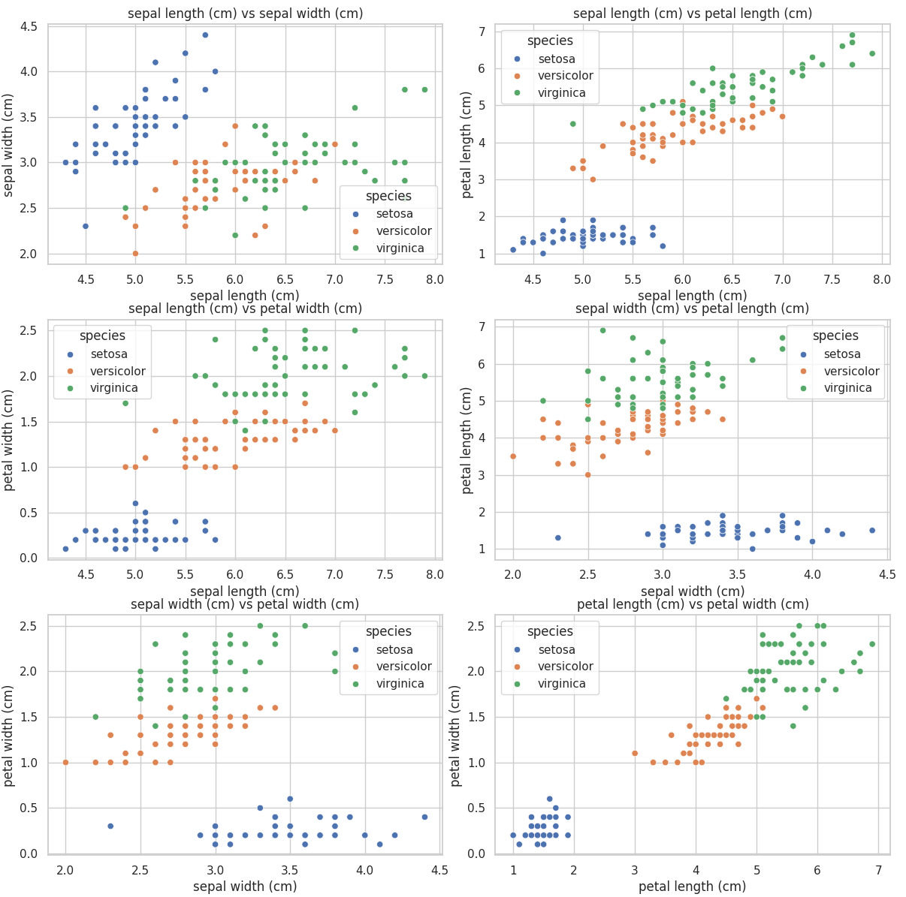

# Understanding the Iris Dataset and Model Training

## Background

### Iris Dataset

The Iris dataset is a renowned dataset in the field of machine learning and statistics. It is frequently used for demonstrating various machine learning algorithms and techniques. The dataset consists of 150 observations (individual iris flowers), divided into three species: Setosa, Versicolor, and Virginica. Each observation includes four features that describe the physical dimensions of the flowers:

1. **Sepal Length (cm)**
2. **Sepal Width (cm)**
3. **Petal Length (cm)**
4. **Petal Width (cm)**

For reference, here is an image describing the different parts of a flower (including Sepal and Petal):

The objective is to classify the species of an iris flower based on these four features. The Iris dataset is particularly valuable for its simplicity and the clear distinction between the species based on the provided features.

### Visualization

To better understand the relationships between the features in the Iris dataset, pairwise scatter plots have been generated. Each plot compares two features, with different colors representing the three Iris species.

This image shows pairwise scatter plots of the Iris dataset, illustrating the relationships between the four features (Sepal Length, Sepal Width, Petal Length, and Petal Width) for the three Iris species (Setosa, Versicolor, Virginica).

### Training the Data

Training a machine learning model involves the following steps:

1. **Data Preparation**: The dataset is divided into training and testing sets. The training set is used to train the model, while the testing set is used to evaluate the model's performance.

2. **Model Definition**: A machine learning model, such as a neural network, is defined. This model includes layers and parameters that will be adjusted during the training process.

3. **Training Process**: The model is trained on the training dataset. During training, the model learns the relationships between the features and the target labels (species) by minimizing a loss function. This is done through an optimization algorithm, such as gradient descent.

4. **Evaluation**: After training, the model is evaluated on the testing dataset to assess its performance. Metrics such as accuracy are used to determine how well the model can classify new, unseen data.

5. **Optimization**: Techniques such as pruning and quantization can be applied to optimize the model for deployment, particularly on hardware like FPGAs. These techniques help reduce the model size and improve its efficiency without significantly sacrificing accuracy.

### Significance of the Iris Dataset

The Iris dataset is widely used for educational purposes and as a benchmark for various machine learning algorithms. Its simplicity and the clear distinctions between classes make it an ideal starting point for those new to machine learning. It allows researchers and practitioners to experiment with different algorithms and techniques, gaining insights into model training, evaluation, and optimization.

Understanding the Iris dataset and the basics of model training provides a solid foundation for exploring more complex datasets and advanced machine learning concepts.

---

This document aims to provide a comprehensive understanding of the Iris dataset and the fundamental concepts involved in training a machine learning model. The included visualizations and explanations are intended to help readers grasp the relationships within the data and the process of building an effective model.
